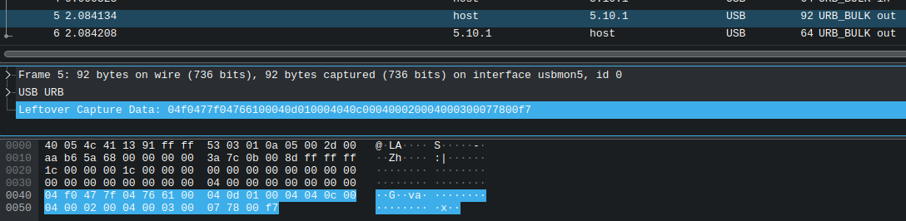

# Akai LPK25 on Linux

The LPK25 is a two-octave MIDI keyboard with some basic octave-shifting,
arpeggiator, and program recall. Akai provide a configuration editor for
Windows and Mac only.

https://www.akaipro.com/downloads

The text below summarises findings from a series of USB captures
using Wireshark, to enable these settings on Linux (or arbitrary OS).

## LPK25 Editor behaviour

The LPK25 Editor sends nothing at startup or shutdown, it only reads
and writes four "PROGRAM" configuration sets. These cover all the
keypad-controlled settings available in the hardware and a few more.

e.g. MIDI channel to output, octave select, Arp on/off/mode/tempo,
Latch (sustain).

# LPK25 Editor USB interaction

The details recorded below can be used on Linux to reproduce these
functions using the "amidi" command - see the script(s) in this repository.

To reproduce: set up Wireshark for USB capture (posix group membership
to run as a user, `modprobe usbmon`, and setting read permission on
`/dev/usbmon*`). Find your keyboard using `lsusb` to identify which bus
it is connected to, e.g.

```
lsusb | grep -i Akai
Bus 005 Device 010: ID 09e8:0076 AKAI  Professional M.I. Corp. LPK25 MIDI Keyboard
```

Start Wireshark and select interface `usbmon5` for bus 5.
Run the Akai tool in Wine, and view the URB data between host and device.



## Generic MIDI USB event packet formatting

See "USB-MIDI Event Packets" in the usb.org MIDI spec
https://www.usb.org/sites/default/files/midi10.pdf

Each event is four bytes
(cable:4, code-index:4) MIDI_0 MIDI_1 MIDI_2

```
Codes
0x04 SysEx starts or continues
0x05 SysEx ends with 1 byte (or single-byte System Common Message)
0x06 SysEx ends with 2 bytes
0x07 SysEx ends with 3 bytes
0x08 Note-off
0x09 Note-on
```

## NOTES

Generic MIDI notes are
* ON:  `[8x nn vv]`
* OFF: `[9x nn vv]`

where
* `x` is the channel (0-15 for channels 1-16)
* `nn` is the note code (0x60 is C4, middle C)
* `vv` is the velocity

USB MIDI uses its own 08/09 prefix and then the above, which is slightly redundant:

```
0000 09 90 3C 60
0000 08 80 3C 7F
```

On the LPK25, the Off velocity is always 7F.

## PROGRAM

Each event is a SysEx code 04 and three bytes, except possibly the last
to indicate short events. Usually we see a 07 here.

## PROGRAM n SEND

SEND PROGRAM URB_BULK out endpoint 01

```
0000   04 f0 47 7f  04 76 61 00  04 0d PP CH  04 OC TR AA   ..G..va.........
0010   04 MD TD CK  04 LT 03 00  07 TM AO 00                .........<..
```

device responds with empty URB_COMPLETE on the in endpoint 81

The positions marked above have the following parameters:

* PP: Program number 01-04
* CH: MIDI Channel (+1)
* OC: Octave (5 is mid position, 6 for +1 etc)
* TR: Transpose (0x0C=0/C, to 0x00=-12, 0x18=+12)
* AA: Arp active: 00=Off, 01=On

* MD: Arp mode: 0=Up, 1=Down, 2=Excl, 3=Incl, 4=Order, 5=Random
* TD: Time division 0=1/4, 2=1/8, 4=1/16, 6=1/32 (7=1/32T)
* CK: Clock 0=Internal, 1=External
* LT: Latch 0=Off, 1=On
* TM: Tempo 30-240
* AO: Arp octaves 00-03 (+1)

## PROGRAM n GET

GET PROGRAM URB_BULK out endpoint 80

```
0000   04 f0 47 7f  04 76 63 00  07 01 PP f7                ..G..vc.....
```

device responds with URB_COMPLETE on the in endpoint 81:

```
0000   04 f0 47 7f  04 76 63 00  04 0d PP 00  04 04 0c 00   ..G..vc.........
0010   04 00 02 00  04 00 02 00  07 3c 00 f7  00 00 00 00   .........<......
0020   00 00 00 00  00 00 00 00  00 00 00 00  00 00 00 00   ................
0030   00 00 00 00  00 00 00 00  00 00 00 00  00 00 00 00   ................
```

Is the null padding needed? Who knows.

# Using `amidi`

Taking the sequences above, stripping out the `04` event code gives us bare
SysEx messages. These can be fed to `amidi`:

```
amidi --list-devices

amidi -p hw:4,0,0  -S 'f0 47 7f 76 63 00 01 01 f7' -d -t 1

F0477F7663000D0100040C000302000003003C00F7
21 bytes read

amidi -p hw:4,0,0 -S 'f0 47 7f 76 61 00 0d 01 00 04 0c 00 03 02 00 00 03 00 3c 00 f7'
```
